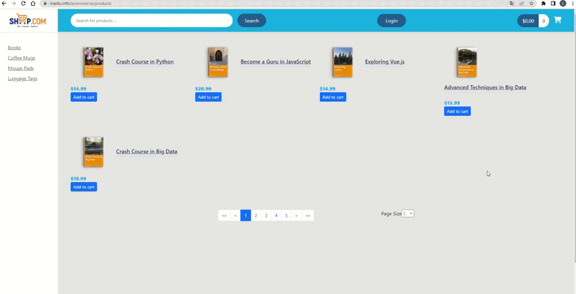

# Ecommerce Website

> The is a full stack e-commerce web application that allows users to buy products online with credit card payment.Created backend by Spring Boot using RESTful API and JPA to integrate MySQL database; applied Postman to do test.Developed a shopping cart with Angular frontend and Spring Boot backend integration.Okta Sign-in Widget is applied to authenticate users.Stripe API for credit card payments.Deployed this web application to a Linux VPS and configured Apache and MySQL to make all connections are based on SSL.
>  

[Click to view the Ecommerce Websit](https://meiliu.info/ecommerce)

## Table of Contents

- [Technologies Used](#technologies-used)
- [Features](#features)
- [Screenshots](#screenshots)

## Technologies Used

- Spring Boot
- Angular
- MySQL
- Postman
- Okta Sign-in Widget
- Stripe API

## Features

The ready features are:

- User's log in and log out features.
- Provides categorized products web pages and product details page for user to review.
- A shopping cart is created for online purchase.
- Stripe credit card payment method.
- Historical order review page.

## Screenshots

